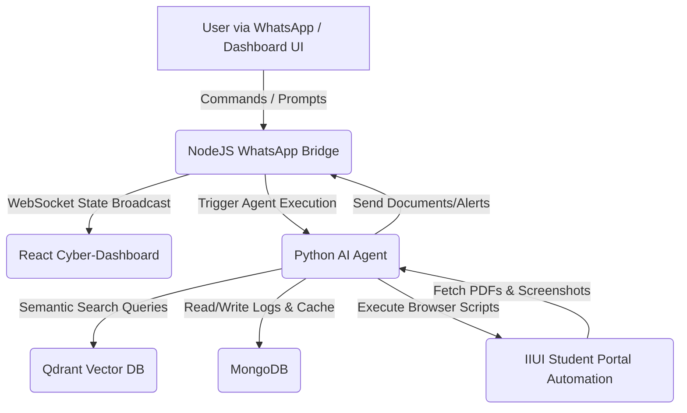

# ⚡ HERALD: Autonomous ERP Agent & WhatsApp Bridge System

```
  ██╗  ██╗███████╗██████╗  █████╗ ██╗     ██████╗ 
  ██║  ██║██╔════╝██╔══██╗██╔══██╗██║     ██╔══██╗
  ███████║█████╗  ██████╔╝███████║██║     ██║  ██║
  ██╔══██║██╔══╝  ██╔══██╗██╔══██║██║     ██║  ██║
  ██║  ██║███████╗██║  ██║██║  ██║███████╗██████╔╝
  ╚═╝  ╚═╝╚══════╝╚═╝  ╚═╝╚═╝  ╚═╝╚══════╝╚═════╝ 
```

[](https://github.com/Ahmarwajahat/HERLAD)
[](https://nodejs.org)
[](https://python.org)
[](https://mongodb.com)
[](https://qdrant.tech)

---

## 📖 Project Overview

**HERALD** is a state-of-the-art autonomous AI agent ecosystem designed to automate operations on the **IIUI Student Portal (Ibadat International University)** and bridge communication directly via **WhatsApp** and a premium, futuristic web **Dashboard**. 

The system leverages a hybrid approach:
- **Autonomous RAG (Retrieval-Augmented Generation)** using Qdrant Vector Store to extract and query relevant academic files.
- **Playwright-driven Browser Automation** to interact securely with the student portal, fetching unofficial transcripts, generating fee challans, capturing attendance metrics, and fetching exam admit cards.
- **WhatsApp Bridge Server** powered by `whatsapp-web.js` running inside a headless Puppeteer browser, allowing users to control the agent with simple chat instructions.
- **Vite + React Admin Dashboard** featuring a gorgeous dark cyberpunk style, showing live logs, system connections, database statuses, and WhatsApp QR codes.

---

## 🏗️ Architecture & Component Design



---

## 🛠️ System Requirements & Prerequisites

To run this project locally on a Linux server (Kali Linux, Ubuntu, or Debian), ensure you have the following installed:

- **Node.js** (v18 or higher recommended, preferably v22)
- **Python 3.11** (with virtual environment support)
- **Chromium/Chrome Browser** (with support for headless operations)
- **MongoDB** (Running locally or in Docker)
- **Qdrant Vector DB** (Local directory store or Cloud service)
- **X11 display / virtual frame buffer** (if running via systemd service)

---

## 🚀 Setup & Installation (Step-by-Step)

### 1. Clone & Setup Workspace
```bash
git clone https://github.com/Ahmarwajahat/HERLAD.git
cd openwork_project
```

### 2. Environment Configuration (`.env`)
Create a `.env` file in the root directory and populate it with the appropriate keys:
```env
# API Keys for LLM orchestration
GEMINI_API_KEY=your_gemini_api_key
SAMBANOVA_API_KEY=your_sambanova_api_key
OPENROUTER_API_KEY=your_openrouter_api_key
CEREBRAS_API_KEY=your_cerebras_api_key

# WhatsApp Configs
MY_WHATSAPP_NUMBER=923430699325
OWNER_NUMBER=923430699325

# Database Configs
MONGO_URL=mongodb://localhost:27017/
QDRANT_URL=http://localhost:6333  # Leave blank to run local file database

# Display Server Configuration (Crucial for Puppeteer/Playwright under Systemd)
DISPLAY=:0
```

### 3. Setup Python Virtual Environment
```bash
python3 -m venv .venv
source .venv/bin/env/activate  # Or activate manually
./.venv/bin/pip install --upgrade pip
./.venv/bin/pip install -r requirements.txt
```

### 4. Install Node.js Dependencies (WhatsApp Bridge & Dashboard)
```bash
# Setup WhatsApp Bridge
cd whatsapp-bridge
npm install
cd ../

# Setup Cyber Dashboard
cd dashboard
npm install
cd ../
```

---

## 🍃 MongoDB Setup

You can run MongoDB using one of the following two options:

### Option A: Using Docker (Recommended)
Run the official MongoDB container in the background:
```bash
docker run -d --name mongodb-local -p 27017:27017 -v mongo_data:/data/db mongo:latest
```

### Option B: Local Installation on Kali/Debian
1. Import GPG Keys:
   ```bash
   curl -fsSL https://pgp.mongodb.com/server-7.0.asc | sudo gpg -o /usr/share/keyrings/mongodb-server-7.0.gpg --dearmor
   ```
2. Add Debian Repository with SHA-1 Bypass:
   ```bash
   echo "deb [ arch=amd64,arm64 signed-by=/usr/share/keyrings/mongodb-server-7.0.gpg trusted=yes ] https://repo.mongodb.org/apt/debian bookworm/mongodb-org/7.0 main" | sudo tee /etc/apt/sources.list.d/mongodb-org-7.0.list
   ```
3. Install and Start:
   ```bash
   sudo apt update
   sudo apt install -y mongodb-org
   sudo systemctl start mongod
   sudo systemctl enable mongod
   ```

---

## 🖥️ Running the Application

### Method 1: Manual Terminal Mode
Open three terminals in the workspace and launch the services:

1. **Terminal 1: WhatsApp Bridge**
   ```bash
   cd whatsapp-bridge
   node server.js
   ```
2. **Terminal 2: HERALD AI Agent**
   ```bash
   ./.venv/bin/python3 -u main.py
   ```
3. **Terminal 3: React Dashboard**
   ```bash
   cd dashboard
   npm run dev
   ```

### Method 2: Automated Background Systemd Services (Recommended)
To run HERALD persistently as system background daemons, systemd services are pre-configured.

1. **Copy the service files**:
   ```bash
   mkdir -p ~/.config/systemd/user/
   cp systemd/herald-agent.service ~/.config/systemd/user/
   cp systemd/herald-bridge.service ~/.config/systemd/user/
   systemctl --user daemon-reload
   ```

2. **Start and enable the background daemons**:
   ```bash
   systemctl --user enable herald-bridge.service
   systemctl --user start herald-bridge.service
   
   systemctl --user enable herald-agent.service
   systemctl --user start herald-agent.service
   ```

3. **Monitor running status & logs**:
   ```bash
   systemctl --user status herald-bridge.service
   systemctl --user status herald-agent.service
   
   # View live logs
   tail -f logs/startup.log
   ```

---

## 📱 WhatsApp Connection & Logout Controls

### Connecting WhatsApp to HERALD
1. Open the Cyber-Dashboard in your web browser (usually at `http://localhost:5173`).
2. If your WhatsApp is not connected, you will see a badge displaying **SCAN REQUIRED** and a **Connect** button at the top header.
3. Click the **Connect** button.
4. The system will start a clean Puppeteer process and broadcast a fresh QR code onto the screen.
5. Open WhatsApp on your mobile device $\rightarrow$ **Settings** $\rightarrow$ **Linked Devices** $\rightarrow$ **Link a Device** and scan the QR code.
6. Once connected, the header will instantly update to **WhatsApp: Connected (READY)**.

### Logging Out and Connecting a New Number
If you want to unlink the current WhatsApp account and connect a new one:
1. Click the **Logout** button next to the WhatsApp Connected badge on the dashboard.
2. Confirm the action.
3. The system will cleanly terminate the active Chromium window, purge the stored session cookies from `.wwebjs_auth/session`, and return to the pairing screen.
4. Click **Connect** to load a new QR code.

---

## ⚡ Using HERALD (Portal Tasks & Commands)

You can send instructions to HERALD either via **WhatsApp message** (if you are the owner) or directly inside the **Agent Command Console** on the dashboard.

### 📜 Available Tasks & Examples (English & Roman Urdu)

| Task | Prompt Example (English) | Prompt Example (Roman Urdu) | System Actions |
|:---|:---|:---|:---|
| **Unofficial Transcript** | `"get me my transcript"` | `"yaar student portal se transcript nikal do"` | Logs in to ERP, downloads the transcript PDF, saves it to `temp_downloads/transcript.pdf`, sends it via WhatsApp. |
| **Fee Challan** | `"download unpaid challan"` | `"unpaid challan do rfid card ka"` | Navigates to accounts, prints fee challan, saves `temp_downloads/challan.pdf`, sends the PDF. |
| **Attendance Report** | `"generate attendance report"` | `"attendance report bana ke do"` | Scrapes attendance statistics, generates a styled Word document (`attendance_report.docx`), sends it to you. |
| **Admit Card** | `"send me my admit card"` | `"admit card bhjoo"` | Accesses the examination tab, prints exam admit card, saves `admit_card.pdf`, and sends it with a confirmation screenshot. |

---

## 🧠 Reinforcement Learning (RL) Decision Agent

HERALD includes a lightweight **Q-Learning / PPO Reinforcement Learning** model that optimizes model selection based on task feedback.
- If a task succeeds, the model receives a **positive reward (+1.0)**, boosting the probability of choosing that LLM for similar prompts.
- If a task fails or times out, the model receives a **negative penalty (-1.0)**, adjusting its parameters.
- Model weights are stored in `agent/ppo_agent.pt` and state mappings in `agent/rl_q_table.json`.

---

## 🗂️ Project Directory Structure

```
openwork_project/
├── agent/                         # Core AI Agent module
│   ├── tools/                     # Integrations (Notifier, Classroom, etc.)
│   ├── brain.py                   # LLM selection, tools execution, system prompts
│   ├── rl_agent.py                # Reinforcement Learning agent definitions
│   └── memory.py                  # MongoDB storage interface
├── dashboard/                     # React dashboard interface
│   ├── src/                       # React components & UI layout
│   └── package.json               
├── rag/                           # Retrieval-Augmented Generation
│   ├── vector_store.py            # Qdrant client connection & schemas
│   └── logger.py                  
├── logs/                          # Runtime logs directory (agent, bridge)
├── temp_downloads/                # Portal downloads repository (PDFs, docs)
├── whatsapp-bridge/               # whatsapp-web.js server implementation
│   ├── server.js                  # Express API, sockets, Puppeteer launcher
│   └── package.json               
├── main.py                        # Entrypoint execution file for Python Agent
├── iiui_portal_helper.py          # Playwright script for Student Portal scraping
├── start.sh                       # Local shell script launcher
├── herald-startup.sh              # Advanced startup script
└── requirements.txt               # Python package configurations
```

---

## 🔍 Troubleshooting & FAQs

### Q1: The QR code is not loading, it shows "Unable to load" or remains white.
- **Cause**: An orphaned Chrome process is holding a lock file in `.wwebjs_auth/session`.
- **Fix**: Kill all background Chrome processes:
  ```bash
  pkill -9 -f chrome
  ```
  Then restart the bridge service:
  ```bash
  systemctl --user restart herald-bridge.service
  ```

### Q2: Qdrant Client shows "red lines" or type errors in the editor.
- **Cause**: The QdrantClient package has dynamic class declarations that static type checkers fail to resolve.
- **Fix**: The client variable has been annotated as `client: Any` inside `rag/vector_store.py` to prevent linters from showing warnings.

### Q3: MongoDB fails to start (`mongod.service` failed).
- **Cause**: A local instance of MongoDB is already running under the user `ahmar` on port 27017, blocking the systemd service.
- **Fix**: This is normal. Since a local instance is already running on port 27017, the HERALD agent connects successfully. You do not need to restart the system service.

### Q4: Puppeteer fails with `Error: Execution context was destroyed`.
- **Cause**: The client was initialized twice or attempted to reuse a closed Puppeteer page.
- **Fix**: This has been resolved by using a dynamic `let client = null` reinitialization routine that destroys the browser before launching a new one.

---

## 👥 UI Design & Development
- **Abu Baker** - UI Designer

---
*Created for ERP Automation & Advanced AI Orchestration.*
